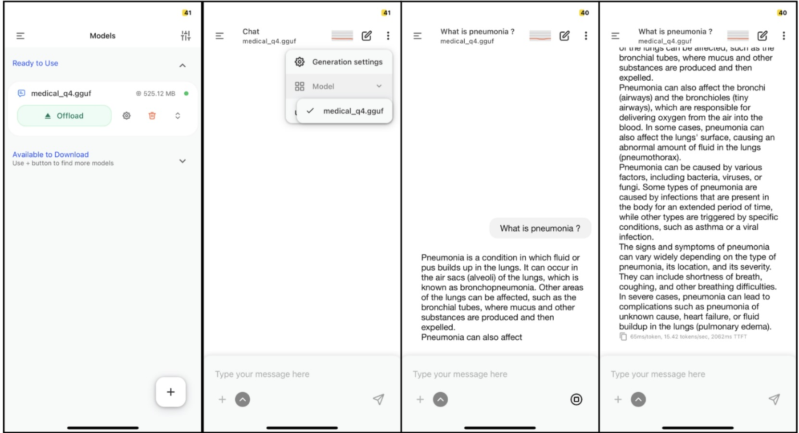

# # 📱 On-Device Medical LLM with Hybrid Edge–Cloud Routing (iPhone Deployment)


## 🚀 Project Overview

This project demonstrates an **end-to-end pipeline for fine-tuning, optimizing, and deploying a domain-specific Medical Large Language Model (LLM) directly on an iPhone device**.

The system follows an **offline-first AI architecture**, where medical queries are handled locally on-device to preserve privacy, while non-medical queries can optionally be routed to a server-based LLM.

The goal is to explore **privacy-preserving mobile AI systems** combining:

* ✅ On-device inference
* ✅ Domain-adapted LLMs
* ✅ Edge–Cloud collaboration
* ✅ Mobile deployment using GGUF + llama.cpp

---

## 🧠 System Architecture

```
User Query
     ↓
On-Device Medical LLM (Local)
     ↓
(Optional Future Extension)
Hybrid Router → Server LLM
```

Current implementation focuses on:

✅ Medical LLM fine-tuning
✅ Model compression & quantization
✅ Mobile deployment preparation

---

## 📂 Repository Structure

```
├── notebooks/
│   ├── medical_finetuning.ipynb
│   ├── model_merge.ipynb
│   ├── gguf_conversion.ipynb
│
├── README.md
└── requirements.txt (optional)
```

All experiments were conducted using **Google Colab notebooks**.

---

## ⚙️ Workflow Pipeline

### 1️⃣ Dataset Preparation

A public medical Question–Answer dataset was used for instruction tuning.

Dataset examples were formatted as:

```
### Instruction:
Answer the medical question clearly.

### Question:
<medical question>

### Response:
<medical answer>
```

---

### 2️⃣ Model Fine-Tuning

Fine-tuning was performed using:

* **Unsloth**
* **LoRA (Low-Rank Adaptation)**
* Instruction tuning paradigm

Key characteristics:

* Parameter-efficient training
* Reduced GPU memory usage
* Domain adaptation without full retraining

Training executed via **Google Colab GPU runtime**.

---

### 3️⃣ LoRA Merge

After training:

```
LoRA adapters + Base model
        ↓
Merged standalone model
```

The merged model was exported using HuggingFace format:

```
model.safetensors
config.json
tokenizer files
```

---

### 4️⃣ Model Quantization

To enable mobile inference, the model was converted into **GGUF format** using:

```
llama.cpp
```

Quantization type:

```
q4_k_m
```

This significantly reduces:

* Model size
* RAM usage
* Mobile inference latency

Final output:

```
medical_q4.gguf
```

---

### 5️⃣ iPhone Deployment Preparation

The GGUF model enables **fully offline inference** using llama.cpp-based iOS runtimes.

Deployment options include:

* Custom iOS application (Xcode + llama.cpp)
* Existing GGUF-compatible mobile LLM apps

The model runs locally without internet connectivity.

---

## 📱 On-Device Inference Characteristics

| Feature                | Status |
| ---------------------- | ------ |
| Offline execution      | ✅      |
| Privacy preserving     | ✅      |
| Internet required      | ❌      |
| Medical domain adapted | ✅      |
| Mobile compatible      | ✅      |

Expected performance on iPhone X:

* ~1–3 tokens/sec generation
* Fully local inference
* No server dependency

---

## 🔐 Privacy-First Design

The system follows an **offline-first AI principle**:

* Medical queries remain on-device
* Sensitive user data is not transmitted
* Cloud usage can be optionally enabled

---

## 🌐 Future Work (Planned)

* Hybrid Local–Cloud LLM routing
* Lightweight intent planner model
* Automatic model switching
* User permission-aware cloud fallback
* Conversation memory across models
* Medical safety guardrails

---

## 🧪 Environment

Training & Conversion:

* Google Colab
* Python
* PyTorch
* Transformers
* Unsloth
* llama.cpp

Deployment Target:

* iOS (iPhone X and newer)

---

## ▶️ How to Reproduce

1. Open provided `.ipynb` notebooks in Google Colab
2. Run fine-tuning notebook
3. Merge trained model
4. Convert model to GGUF format
5. Transfer GGUF model to iPhone runtime

---

## ⚠️ Disclaimer

This system provides **general medical information only** and is **not intended for diagnosis or clinical decision-making**.

Always consult qualified healthcare professionals for medical advice.

---

## 📌 Contribution & Research Purpose

This project is intended for:

* Mobile AI research
* Edge AI experimentation
* Privacy-preserving LLM deployment
* Academic exploration of hybrid AI systems

---

## ⭐ Acknowledgements

* HuggingFace Transformers
* Unsloth
* llama.cpp
* Open-source AI community

---

## 📄 License

This project is released for research and educational purposes.

---

## 👨‍💻 Author

# **Md Saib Hossain**
**AI Engineer • AI / ML / LLM & AI Safety Researcher**  
**Agentic AI Developer • Researcher in Autonomous & Multi-Agent Systems • Advanced Agentic AI Architect**

Designing safe, scalable, and human-centered intelligent systems for real-world healthcare and autonomous AI applications.

<p align="left">
  <a href="mailto:saibhossain5@gmail.com">
    
  </a>
  
  <a href="https://saibhossain.github.io/">
    
  </a>
  <a href="https://github.com/Saibhossain">
    
  </a>
  <a href="https://linkedin.com/in/saib-hossain-182834229">
    
  </a>
</p>
